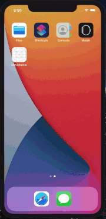

# movietastic
A complete Movie Searching app built with Swift 5, MVVM and OMDB Api

Specs:

- XCode 12 
- Swift 5
- MVVM design pattern
- SD Web Image for image loading  
- CoreData database 
- System components  
- System Navigation Component  
- Lottie for animations 
- Alamofire for API calls 
- Codable for serializing/deserializing 

Features:

- Search Movies
- Searched Movies are automatically saved for future search
- Go through Movie Details
- Pagination
- Infinity Scroll
- Pull To Refresh
